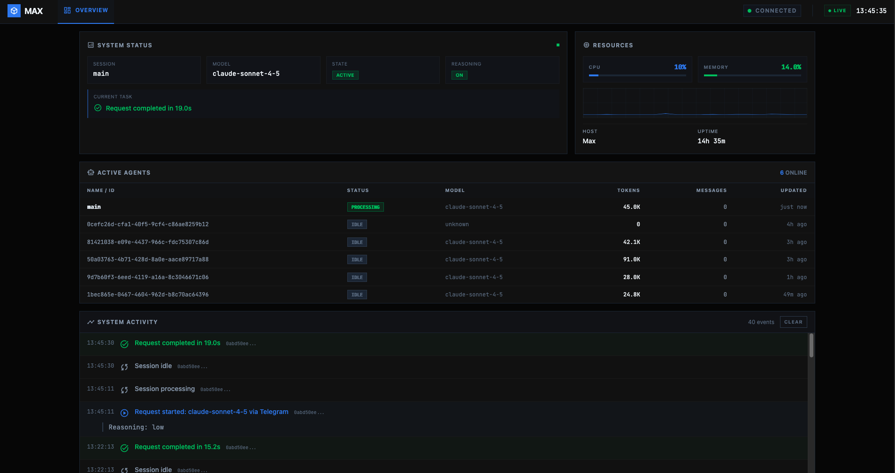
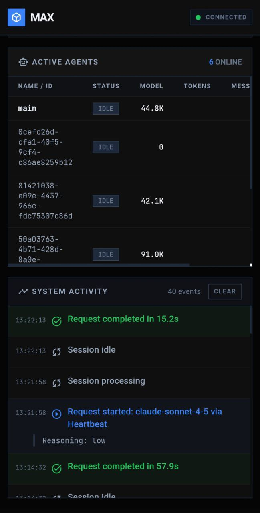

# MAX - Molt.bot Monitoring Dashboard


Real-time monitoring dashboard for Molt.bot AI agents. Track sessions, system resources, agent activity, and more with a sleek dark-themed interface.

## Screenshots

### Desktop


### Mobile
<p align="center">
  
  
</p>

## Features

- **Real-time Monitoring** - Live updates every 2 seconds
- **Session Tracking** - View all active agent sessions with model, tokens, and status
- **System Resources** - CPU and memory usage with live charts
- **Activity Log** - Detailed event log with reasoning, tool calls, and responses
- **Responsive Design** - Works on desktop, tablet, and mobile
- **Dark Theme** - Modern dark interface optimized for visibility

## Requirements

- Node.js 16.0.0 or higher
- Molt.bot running with default log configuration

## Installation

### Option 1: Clone and Run

```bash
git clone https://github.com/a2-stuff/max-dashboard.git
cd max-dashboard
npm start
```

### Option 2: Install Globally

```bash
npm install -g max-dashboard
max-dashboard
```

### Option 3: Run with npx

```bash
npx max-dashboard
```

## Installation Locations

Depending on the installation method, MAX Dashboard is installed in different locations:

| Method | Location |
|--------|----------|
| Global (`npm install -g`) | `~/.npm-global/lib/node_modules/max-dashboard/` or `/usr/local/lib/node_modules/max-dashboard/` |
| Local (`npm install`) | `./node_modules/max-dashboard/` |
| npx | Temporary cache in `~/.npm/_npx/` |
| Clone | Wherever you clone it (e.g., `~/projects/max-dashboard/`) |

**Note:** The installation location doesn't affect functionality. MAX Dashboard always reads Molt.bot data from the user's home directory:
- Sessions: `~/.moltbot/agents/main/sessions/` or `~/.clawdbot/agents/main/sessions/`
- Logs: `/tmp/moltbot/`

## Configuration

### Environment Variables

| Variable | Default | Description |
|----------|---------|-------------|
| `MAX_DASHBOARD_PORT` | `8181` | Port to run the dashboard on |
| `MAX_DASHBOARD_NO_AUTH` | `false` | Set to `true` to disable authentication |

### Example

```bash
# Run on custom port
MAX_DASHBOARD_PORT=3000 npm start

# Disable authentication (not recommended for public networks)
MAX_DASHBOARD_NO_AUTH=true npm start
```

## Authentication

MAX Dashboard uses HTTP Basic Authentication to protect access. The password is automatically read from your Molt.bot gateway auth token.

### How it works

1. Dashboard reads the gateway auth token from `~/.moltbot/moltbot.json` (under `gateway.auth.token`)
2. When accessing the dashboard, your browser will prompt for credentials
3. **Username**: Can be anything (e.g., `admin`)
4. **Password**: Your Molt.bot gateway auth token

### Disabling Authentication

For local development or trusted networks, you can disable authentication:

```bash
MAX_DASHBOARD_NO_AUTH=true npm start
```

**Warning:** Only disable authentication on trusted networks. The dashboard exposes sensitive information about your AI agent sessions.

## Usage

1. Start Molt.bot gateway:
   ```bash
   moltbot gateway
   ```

2. Start Max Dashboard:
   ```bash
   cd max-dashboard
   npm start
   ```

3. Open your browser to:
   ```
   http://localhost:8181
   ```

## Dashboard Panels

### System Status
- **Session** - Current active session name
- **Model** - AI model being used (e.g., claude-sonnet-4-5, claude-opus-4-5)
- **State** - Processing state (Active/Idle)
- **Reasoning** - Whether extended thinking is enabled
- **Current Task** - Shows current activity (tool being used, transcription, user message) or "Waiting for user..." / "Idle"

### Resources
- **CPU** - Real-time CPU usage with sparkline chart
- **Memory** - Memory usage percentage
- **Host** - System hostname
- **Uptime** - System uptime

### Active Agents
Table showing all registered sessions:
- Name/ID
- Status (Active/Idle/Processing)
- Model
- Total tokens used
- Message count
- Last update time

### System Activity
Detailed event log with rich context:

**Tool Executions** - Shows tool name with relevant parameters:
- `exec: <command>` - Shell commands being executed
- `read: <filepath>` - Files being read
- `write: <filepath>` - Files being written
- `edit: <filepath>` - Files being edited
- `browser: <action> <url>` - Browser automation
- `web_fetch: <url>` - URL fetching
- `spawn: <task>` - Sub-agent spawning
- `image: <prompt/path>` - Image analysis or generation
- `whisper/tts: <text>` - Audio transcription and speech

**Request Tracking**:
- Request start with model, channel (WhatsApp, Telegram, etc.), and reasoning mode
- Sub-agent labels when applicable
- Request completion with duration and token usage (input/output)

**Other Events**:
- User messages and bot responses with content preview
- Reasoning/thinking content (extended thinking output)
- Audio transcriptions with transcript text
- Errors with details
- Session state changes

## API Endpoints

### GET /api/status
Returns complete dashboard state including:
- Session information
- System resources (CPU, memory, uptime)
- Active sessions list
- Activity log entries

### GET /api/health
Health check endpoint returning:
```json
{"status": "ok", "timestamp": 1234567890}
```

## File Structure

```
max-dashboard/
├── server.js      # Node.js HTTP server and API
├── index.html     # Dashboard HTML with Tailwind CSS
├── app.js         # Frontend JavaScript
├── style.css      # Additional styles
├── package.json   # NPM configuration
└── README.md      # Documentation
```

## How It Works

1. **Log Parsing** - The server reads Molt.bot's JSON log files from `/tmp/moltbot/moltbot-YYYY-MM-DD.log` and parses entries for activity events including tool calls, requests, responses, and errors.

2. **Session Tracking** - Session data is read from `~/.moltbot/agents/main/sessions/sessions.json` or `~/.clawdbot/agents/main/sessions/sessions.json` (automatically uses whichever has newer data).

3. **System Monitoring** - CPU and memory statistics are gathered using Node.js `os` module and updated in real-time.

4. **Real-time Updates** - The frontend polls `/api/status` every 2 seconds and updates the UI without page refresh using vanilla JavaScript.

## Customization

### Changing the Theme

The dashboard uses Tailwind CSS with a custom configuration. Key colors are defined in `index.html`:

```javascript
tailwind.config = {
  theme: {
    extend: {
      colors: {
        primary: "#3b82f6",           // Blue accent
        secondary: "#22c55e",         // Green accent
        "background-dark": "#050505", // Main background
        "panel-dark": "#0f0f0f",      // Panel background
      }
    }
  }
}
```

### Adding Custom Log Parsers

Edit `server.js` and add patterns to the `parseRecentLogs()` function:

```javascript
// Example: Add custom event detection
else if (data.includes('my_custom_event')) {
    message = 'Custom event detected';
    type = 'custom';
    level = 'info';
}
```

## Troubleshooting

### Dashboard shows "Connecting..."
- Ensure the server is running: `npm start`
- Check the port isn't blocked: `curl http://localhost:8181/api/health`

### No sessions showing
- Verify Molt.bot is running: `moltbot status`
- Check sessions file exists: `ls ~/.moltbot/agents/main/sessions/` or `ls ~/.clawdbot/agents/main/sessions/`

### Activity log empty
- Verify log directory exists: `ls /tmp/moltbot/`
- Check today's log file: `ls /tmp/moltbot/moltbot-$(date +%Y-%m-%d).log`

### Tokens showing 0
- Sessions need at least one completed request to have token counts
- Token counts are cumulative across the session lifetime

## Tech Stack

- **Backend**: Node.js HTTP server (no dependencies)
- **Frontend**: Vanilla JavaScript, Tailwind CSS (CDN)
- **Fonts**: Inter, JetBrains Mono, Material Symbols
- **No build step required** - runs directly with Node.js

## Author

Created by **Jarod** - [@not_jarod](https://twitter.com/not_jarod)

- GitHub: [github.com/a2-stuff](https://github.com/a2-stuff)

## License

MIT License

## Related Projects

- [Molt.bot](https://github.com/moltbot/moltbot) - AI agent gateway
- [ClawdHub](https://clawdhub.com) - Agent skills marketplace
